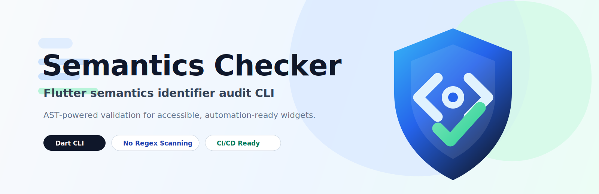

# Semantics Checker

`semantics_checker` adalah tools CLI Dart berbasis **Clean Architecture** yang dikembangkan khusus untuk memastikan standar aksesibilitas dan kemudahan testing otomasi (*automated testing*) pada proyek Flutter Anda. Tool ini bertugas melakukan audit statik menggunakan AST (Abstract Syntax Tree) Parser resmi dari SDK Dart (`package:analyzer`) untuk memvalidasi keberadaan `semanticsIdentifier` pada widget interaktif.

Sangat ideal diintegrasikan ke dalam pipeline CI/CD guna mendeteksi widget interaktif yang tidak memiliki Semantics ID sebelum kode digabungkan ke cabang utama.

---

## 🚀 Fitur Utama

- 🧠 **AST Parsing Akurat (No Regex Scanning)**: Menggunakan parser resmi `package:analyzer` untuk membaca pohon sintaksis Dart, memastikan tidak ada kecocokan palsu (*false positives*) dari komentar atau string biasa.
- 🌿 **Git Integration (Incremental Auditing)**: Secara cerdas mengidentifikasi file Dart yang diubah pada cabang aktif (`git diff`) untuk audit super cepat pada pull-request.
- 📂 **Full Project Scanning**: Dukungan mode `-a` atau `--all` untuk memindai seluruh berkas Dart di dalam direktori `lib/` proyek.
- 📊 **Premium Multi-Format Reports**: Otomatis mengekspor hasil audit ke dalam tiga format profesional sekaligus:
  - **PDF (`semantics_report/report.pdf`)**: Siap untuk laporan tim QA/Produksi.
  - **HTML (`semantics_report/report.html`)**: Dilengkapi dengan UI modern, collapsible list, filter pencarian interaktif, dan status kelulusan.
  - **Markdown (`semantics_report/report.md`)**: Format terstruktur yang siap dibaca langsung dari platform Git.
- 🛠️ **Custom Configuration (`semantics_checker.yaml`)**: Kemudahan mengecualikan berkas, menentukan daftar widget target, dan mengatur ambang batas audit.
- ⚙️ **CI/CD Ready**: Menghasilkan exit code `1` saat ada pelanggaran audit dan `0` saat lulus, sangat andal untuk menjaga pipeline tetap bersih.

---

## 📁 Struktur Kode & Clean Architecture

Proyek ini dirancang menggunakan prinsip **Clean Architecture** untuk memastikan skalabilitas, kemudahan pemeliharaan, dan pemisahan logika bisnis dari I/O eksternal:

```
semantics_checker/
├── bin/
│   └── semantics_checker.dart      # Entry point CLI (executable)
├── lib/
│   ├── semantics_checker.dart      # Public Export file
│   └── src/
│       ├── domain/                 # Layer Inti Bisnis (Pure Dart, Bebas I/O)
│       │   ├── entities/           # Data Models (Issue, Config, FixedItem)
│       │   ├── repositories/       # Abstraksi/Kontrak Repository
│       │   └── usecases/           # Logika Bisnis Utama (RunAuditUseCase)
│       │
│       ├── data/                   # Implementasi I/O & Infrastruktur
│       │   ├── datasources/        # Akses tingkat rendah (Git & File)
│       │   ├── reporters/          # Modul Penyusun Laporan (HTML, PDF, MD)
│       │   └── repositories/       # Realisasi Kontrak Repository
│       │
│       └── presentation/           # Layer Shell Konsol & UI
│           └── cli/
│               └── cli_runner.dart # CLI Controller & Parser Argumen
```

---

## 📦 Cara Memasang di Proyek Flutter

Tambahkan package ini ke bagian `dev_dependencies` di dalam berkas `pubspec.yaml` proyek Flutter target Anda menggunakan referensi Git Repository:

```yaml
dev_dependencies:
  semantics_checker:
    git: https://git.pactindo.com/baso.rizky/semantics_checker.git
```

Jalankan perintah berikut di proyek Flutter Anda untuk mengunduh package:
```bash
flutter pub get
```

---

## ⚙️ Konfigurasi (`semantics_checker.yaml`)

Anda dapat menyesuaikan perilaku auditor dengan membuat berkas konfigurasi bernama `semantics_checker.yaml` pada root direktori proyek Flutter Anda:

```yaml
# Daftar nama widget yang wajib memiliki parameter semanticsIdentifier/ID penanda
target_widgets:
  - CustomButton
  - CustomTextField
  - LabeledTextField
  - CustomButtonAnimationLoading
  - InkWell
  - GestureDetector
  - IconButton

# Pola nama berkas atau jalur folder yang akan dilewati saat scan berlangsung
exclude_paths:
  - ".g.dart"
  - ".freezed.dart"
  - "generated/"
  - "test/"

# [KUSTOM] Format RegExp untuk memvalidasi penamaan ID (default: snake_case)
id_pattern: "^[a-z0-9_]+$"

# [KUSTOM] Daftar nama properti parameter widget yang dianggap sebagai penanda Semantics ID
semantics_properties:
  - semanticsIdentifier
  - identifier
  - identifierId
  - semanticsId
  - testId # Contoh properti kustom baru pada widget Anda
```

---

## 🛠️ Cara Menjalankan

Jalankan perintah berikut di terminal pada root direktori proyek Flutter Anda:

### 1. Memindai File yang Berubah Saja (Default)
Sangat efisien untuk pengujian lokal sebelum commit atau pada Pull Request commit incremental:
```bash
dart run semantics_checker
```

### 2. Memindai Seluruh Proyek (`--all` atau `-a`)
Untuk mengaudit kesehatan seluruh berkas yang ada di dalam folder `lib/`:
```bash
dart run semantics_checker --all
```

---

## 📈 Laporan Output Audit

Setelah audit selesai dijalankan, folder `semantics_report/` akan dibuat berisi berkas-berkas laporan berikut:

- `report.pdf`: Laporan visual formal dengan data tabular rapi dan ringkasan metrik.
- `report.html`: Dasbor interaktif premium dengan fitur pencarian teks, filter status, collapsible detail file, dan saran otomatis penamaan ID.
- `report.md`: Ringkasan instan yang kompatibel dengan markdown parser bawaan Git.

---

## ☁️ Integrasi CI/CD (GitHub Actions / GitLab CI)

Anda dapat mengkonfigurasi langkah audit otomatis di repositori Anda untuk mencegah masuknya kode yang tidak memenuhi standar aksesibilitas.

### GitHub Actions
Tambahkan step berikut di dalam alur `.github/workflows/ci.yml` Anda sebelum langkah pengujian atau pembuatan rilis:

```yaml
- name: Setup Dart/Flutter SDK
  uses: subosito/flutter-action@v2
  with:
    flutter-version: '3.x'

- name: Install dependencies
  run: flutter pub get

- name: Run Semantics Audit
  run: dart run semantics_checker
```

---

## 📄 Lisensi

Proyek ini dilisensikan di bawah lisensi MIT.
